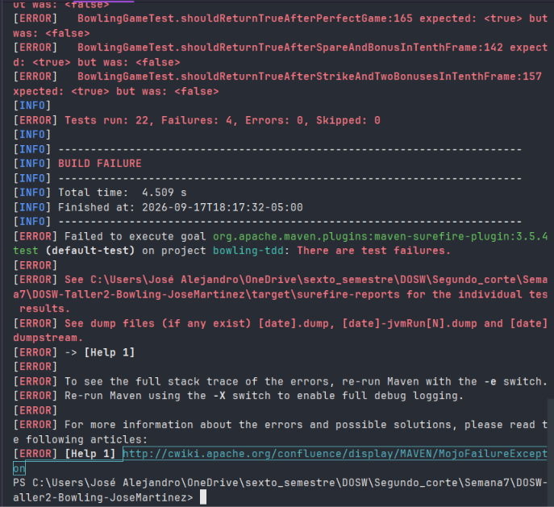
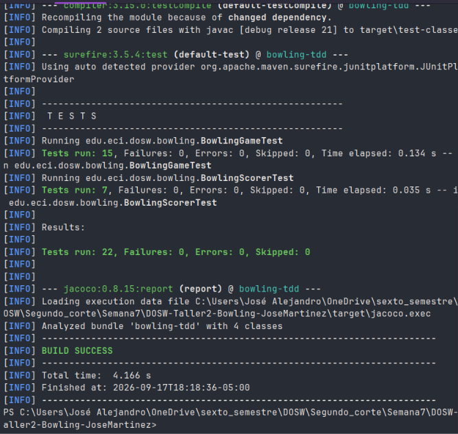
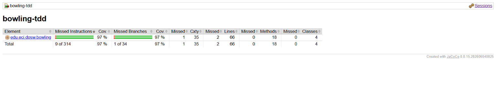
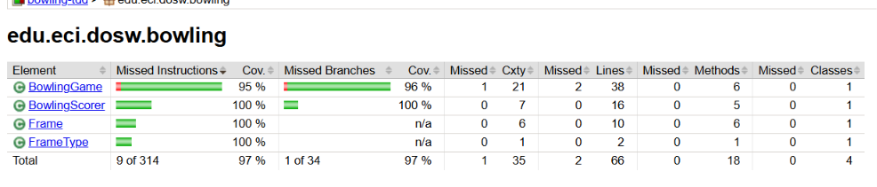
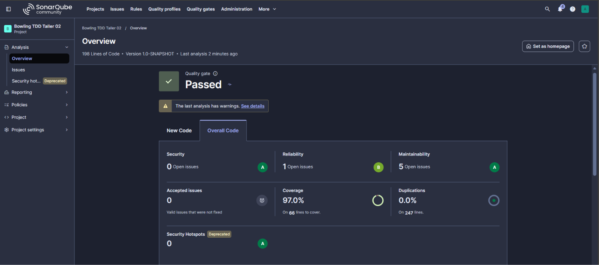
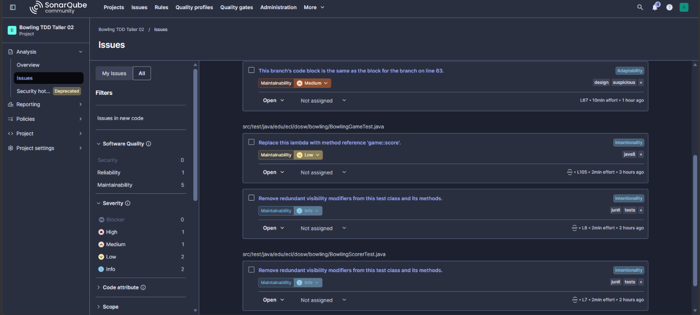
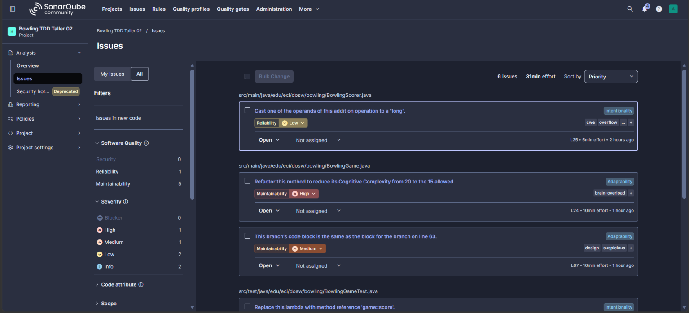

# Taller 2 - Bowling Game (TDD)

## Identificación
**Estudiante:** José Alejandro Martínez
**Asignatura:** Desarrollo de Software y Operaciones (DOSW)

## Descripción del Proyecto
Este proyecto implementa el motor de puntuación de un juego de Bolos (Bowling) para un jugador, siguiendo la metodología **Test-Driven Development (TDD)** y principios de **Clean Code**.
El sistema consta de 10 frames y calcula correctamente los bonos de `Strike` (10 pines en 1 tiro) y `Spare` (10 pines en 2 tiros), permitiendo llegar a un juego perfecto de 300 puntos.

### Responsabilidades de Clases (Principios SOLID)
- **`BowlingGame`**: Actúa como el motor de estado del juego. Se encarga de registrar los tiros (`roll()`), validar que las reglas del juego no se rompan (máximo de pines y frames), y delegar el cálculo del puntaje final.
- **`BowlingScorer`**: Clase sin estado dedicada al cálculo del puntaje (`calculate()`). Recibe los datos y aplica la lógica de bonificaciones.
- **`Frame`**: Representa un turno individual. Guarda los tiros realizados en ese turno y sabe calcular su propia suma básica de pines.
- **`FrameType`**: Enumeración que clasifica el estado de un frame (`NORMAL`, `SPARE`, `STRIKE`, `TENTH`), facilitando el cálculo de bonos.

---

## Evidencias TDD (Red - Green - Refactor)
Durante el desarrollo se aplicó el ciclo de TDD en tres módulos principales (A, B y C). El historial de commits refleja este proceso:

1. **🔴 RED (Fallo):** Se escribieron primero las pruebas (BowlingGameTest`) capturando los requisitos. Al ejecutar, las pruebas fallaban porque la lógica no existía.

   

2. **🟢 GREEN (Pasa):** Se implementó el código mínimo necesario en `BowlingGame` para hacer que las pruebas pasaran a verde.

   

3. **🔵 REFACTOR (Mejora):** Se mejoró el código sin cambiar su comportamiento. Por ejemplo:
    - Se extrajo la lógica matemática del puntaje hacia una nueva clase sin estado `BowlingScorer`.
    - Se usó programación funcional (Java Streams) para el cálculo.
    - Se eliminaron *Magic Numbers* implementando las constantes `MAX_FRAMES` y `MAX_PINS`.

---

## Métricas de Calidad
### Cobertura de Código (JaCoCo)
El proyecto cuenta con **22 pruebas unitarias** que garantizan el correcto funcionamiento de todas las reglas del boliche.
- **Cobertura alcanzada:** 97% de Instrucciones / 97% de Ramas (Superando el 85% exigido en la primera vez que se ejecuto).
  
  

### Análisis Estático (SonarQube)
El código fue analizado localmente asegurando el cumplimiento del Quality Gate y los issues.

---
## Pull Requests
Los cambios llegaron a develop solo por Pull Request. No hay commits directos sobre develop.

| Enlace al PR                            | Fecha de Merge | Módulo que cubre                                                              |
|:----------------------------------------|:---------------|:------------------------------------------------------------------------------|
| [PR #1: Implementación Motor Bowling](https://github.com/JoseMartinez883/DOSW-Taller2-Bowling-JoseMartinez/pull/1) | *17/09/2026*   | Módulos A, B y C (Lógica completa, Puntuación y Refactor), Jacoco y SonarQube |

---

##  Preguntas de Reflexión Técnicas

1. **¿Qué caso edge del Bowling fue el más difícil de implementar con TDD y por qué?**
   El décimo frame (Tenth Frame) fue el caso más dificl. Tiene reglas especiales que rompen el flujo normal de 2 tiros por frame, ya que permite hasta 3 tiros si se hace un Strike o Spare. Escribir las pruebas primero (como los casos A8, C4 y C5) nos obligó a crear un estado específico (`FrameType.TENTH`) en lugar de intentar meter toda la lógica dentro de un `if` gigante.

2. **¿Qué parte del código cambió durante REFACTOR sin modificar el comportamiento observable?**
   El cambio más grande fue la extracción del cálculo matemático hacia la clase `BowlingScorer`. Inicialmente, la suma de puntos estaba fuertemente acoplada dentro de `BowlingGame`. En la fase de REFACTOR, movimos toda la lógica de bonificaciones a `BowlingScorer` usando programación funcional (Java Streams), y eliminamos los *Magic Numbers* implementando las constantes `MAX_FRAMES` y `MAX_PINS`. Gracias a las 22 pruebas que ya estaban en verde, garantizamos que el comportamiento del usuario final no cambió en lo absoluto.

3. **¿Qué casos de prueba descubriste al revisar el reporte de cobertura de JaCoCo que no habían considerado antes?**
   JaCoCo fue clave para visualizar la cobertura de ramas (Branches). Al principio nos enfocamos en el "Happy Path", pero el reporte nos mostró en rojo las ramas de validación (Exceptions). Esto nos llevó a formalizar casos como el A4 (Intentar derribar más de 10 pines combinados en un mismo frame) o el A5 (Intentar lanzar después de haber terminado el juego). JaCoCo garantizó que todos esos `if` de seguridad fueran ejecutados.

4. **¿Qué hallazgo de SonarQube produjo un cambio real en el código?**
   SonarQube detectó *Code Smells* relacionados con la legibilidad y la duplicación de numeros. Aunque el código funcionaba, el análisis estático advirtió sobre el uso repetitivo del número `10` en el código fuente. Esto fue la causa para realizar el refactor hacia las constantes `MAX_FRAMES` y `MAX_PINS`. Adicionalmente, el análisis nos obligó a limpiar `imports` sin uso (como el de `IntStream` en `BowlingGame`) que habían quedado innecesario tras nuestro refactor hacia el Scorer.
